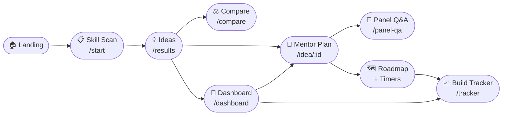
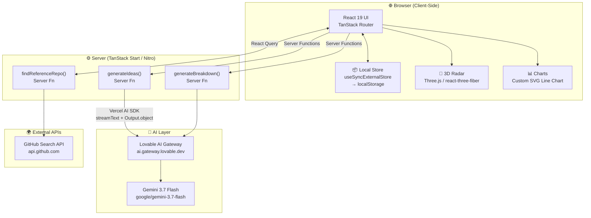
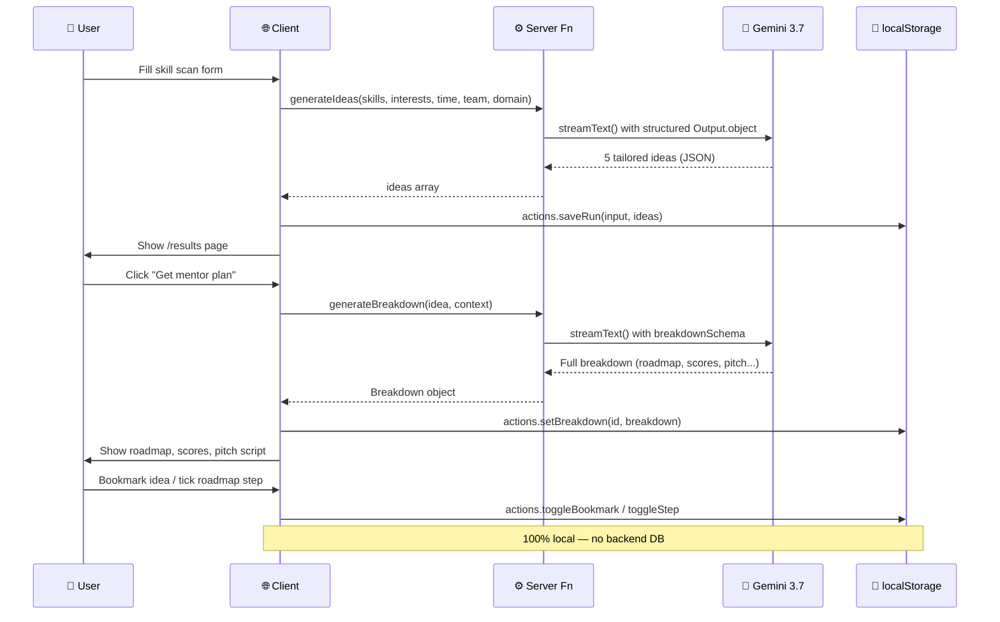
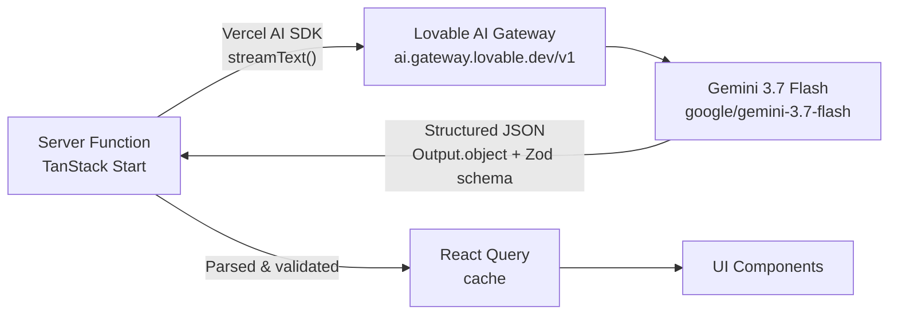

<div align="center">

# ⚡ ProjectRadar

**AI Mentor for Final-Year CSE & AI-ML Capstones**

> *Stop picking the same project. Build something the panel hasn't seen 50 times.*

[](https://www.typescriptlang.org/)
[](https://react.dev/)
[](https://tanstack.com/start)
[](https://vite.dev/)
[](https://tailwindcss.com/)
[](https://deepmind.google/technologies/gemini/)

</div>

---

## 📡 What is ProjectRadar?

**ProjectRadar** is an AI-powered web application that helps final-year engineering students (CSE / AI-ML) discover, plan, and execute unique capstone projects. Feed it your skills, interests, and timeline — it returns 5 tailored project ideas with full mentor plans, uniqueness scores, roadmaps, panel Q&A prep, and even a resume bullet.

**Everything runs local-first** — your data lives in `localStorage` and never leaves your browser.

---

## ✨ Features at a Glance

| Module | What it does |
|---|---|
| 🔍 **Skill Scan** | Analyze your stack + time budget → generate 5 unique, genuinely buildable ideas |
| 🧠 **AI Mentor Plan** | Full breakdown: features, tech stack, 7–10 step roadmap, uniqueness score, twist |
| 🎤 **Panel Q&A** | Stress-test your idea against questions your viva panel will ask |
| 📊 **Uniqueness Score** | 0–100 score showing how done-to-death an idea is + the twist that makes it different |
| 🗺️ **Roadmap + Timers** | Build steps become a live checklist with per-step timers — doubles as your tracker |
| 📈 **Build Tracker** | Log code written, bugs fixed, and deployments; visualize momentum on a live chart |
| 🔖 **Dashboard** | All bookmarked ideas, progress bars, and matching GitHub reference repos |
| ⚖️ **Idea Comparison** | Compare two ideas side-by-side on uniqueness, impact, and learning curve |
| 📝 **Pitch Script** | Auto-generated 60-second spoken elevator pitch for your guide or panel |
| 💼 **Resume Line** | One strong, ready-to-paste resume bullet per project |

---

## 🗺️ User Journey



---

## 🏗️ Architecture



---

## 📂 Project Structure

```
ProjectRadar/
├── src/
│   ├── routes/                     # File-based routing (TanStack Router)
│   │   ├── __root.tsx              # Root layout, nav, React Query provider
│   │   ├── index.tsx               # 🏠 Landing page + 3D radar hero
│   │   ├── start.tsx               # 📋 Skill Scan form
│   │   ├── results.tsx             # 💡 Ideas grid
│   │   ├── idea.$ideaId.tsx        # 🧠 Full Mentor Plan (breakdown, roadmap, timers)
│   │   ├── dashboard.tsx           # 🔖 Bookmarked ideas + GitHub refs
│   │   ├── tracker.tsx             # 📈 Build journal + momentum chart
│   │   ├── compare.tsx             # ⚖️ Side-by-side idea comparison
│   │   ├── panel-qa.tsx            # 🎤 Panel Q&A drill
│   │   └── judge.tsx               # 🏆 AI judging mode
│   │
│   ├── components/
│   │   ├── radar/                  # 🎯 Animated radar canvas (OGL)
│   │   │   ├── radar-base.tsx      # Rings + grid overlay
│   │   │   ├── radar-sweep.tsx     # Rotating sweep arm
│   │   │   ├── radar-targets.tsx   # Blip targets + labels
│   │   │   └── radar-particles.tsx # Background particles
│   │   ├── charts/
│   │   │   └── line-chart.tsx      # Composable SVG line chart
│   │   ├── radar-3d.tsx            # Three.js 3D radar scene (lazy-loaded)
│   │   ├── aurora.tsx              # Animated aurora background (OGL)
│   │   ├── site-nav.tsx            # Responsive navigation bar
│   │   ├── idea-card.tsx           # Idea card with bookmark + score chips
│   │   ├── tag-input.tsx           # Multi-tag skill/interest input
│   │   ├── count-up.tsx            # Animated number counter
│   │   ├── page-shell.tsx          # Page wrapper with nav + footer
│   │   ├── states.tsx              # Empty / error / loading states
│   │   └── ui/                     # shadcn/ui primitives (Radix UI)
│   │
│   ├── lib/
│   │   ├── store.ts                # 📦 Global state (localStorage, no Redux)
│   │   ├── mentor-types.ts         # Zod schemas: Idea, Breakdown, GeneratorInput
│   │   ├── mentor.functions.ts     # AI server fns: generateIdeas, generateBreakdown
│   │   ├── github.functions.ts     # GitHub search server fn
│   │   ├── ai-gateway.server.ts    # Lovable AI Gateway + model config
│   │   └── utils.ts                # cn() helper
│   │
│   ├── hooks/
│   │   └── use-mobile.tsx          # Responsive breakpoint hook
│   │
│   ├── router.tsx                  # TanStack Router instance
│   ├── server.ts                   # Nitro server entry
│   ├── start.ts                    # App entry point
│   └── styles.css                  # Global Tailwind v4 styles + design tokens
│
├── DESIGN_SYSTEM.md                # Design token + component rules
├── components.json                 # shadcn/ui config
├── vite.config.ts                  # Vite + TanStack + Tailwind config
└── package.json
```

---

## 🔄 Data Flow



---

## 🧩 State Management

ProjectRadar uses a **zero-dependency, localStorage-backed store** built on React's `useSyncExternalStore`:

```
StoreState
├── input          → Last GeneratorInput (skills, interests, time, team, domain)
├── ideas          → Idea[]  (title, pitch, difficulty, timeline, domain, tags, id)
├── bookmarks      → string[]  (idea IDs)
├── breakdowns     → Record<ideaId, Breakdown>
│                      (features, stack, roadmap, uniquenessScore, pitchScript...)
├── progress       → Record<ideaId, number[]>  (completed roadmap step indices)
├── timers         → Record<ideaId, Record<stepIndex, StepTimer>>
│                      (elapsedMs + startedAt for per-step time tracking)
├── logs           → BuildLog[]  (code | bug | deploy | note entries)
└── answers        → Record<ideaId, Record<questionId, string>>  (Panel Q&A)
```

> **No Redux. No Zustand. No context hell.** One `useStore()` hook, one `actions` object, ~200 lines total.

---

## 🤖 AI Integration



| AI Call | Schema | Output |
|---|---|---|
| `generateIdeas()` | `ideasSchema` | 5× `{ title, pitch, difficulty, timeline, domain, tags }` |
| `generateBreakdown()` | `breakdownSchema` | `{ summary, features[], stack[], roadmap[], uniquenessScore, twist, pitchScript, resumeLine, impactScore, learningCurve }` |

**Fallback strategy**: If the model can't produce structured output, the server functions regex-extract the JSON from the raw text and re-validate with Zod before throwing.

---

## 🎯 Routes Overview

| Route | Description |
|---|---|
| `/` | Hero with live 3D radar canvas + animated stats |
| `/start` | Skill scan form (tags, selects, team toggle) |
| `/results` | 5 idea cards with difficulty + domain filters |
| `/idea/:ideaId` | Full mentor plan, roadmap with timers, scores |
| `/dashboard` | Bookmarked ideas + roadmap progress + GitHub refs |
| `/tracker` | Build journal + cumulative momentum line chart |
| `/compare` | Side-by-side idea comparison (scores + stack) |
| `/panel-qa` | AI-generated viva questions + answer drills |
| `/judge` | AI judging / evaluation mode |

---

## ⚙️ Tech Stack

```
┌─────────────────────────────────────────────────┐
│                  FRONTEND                        │
│  React 19 · TanStack Router · TanStack Query     │
│  Tailwind CSS v4 · Radix UI · shadcn/ui          │
│  Three.js · @react-three/fiber · OGL             │
│  Lucide React · Zod                              │
├─────────────────────────────────────────────────┤
│                  SERVER                          │
│  TanStack Start · Nitro · Vite 8                 │
│  TypeScript 5.8 · Bun                            │
├─────────────────────────────────────────────────┤
│                  AI / EXTERNAL                   │
│  Vercel AI SDK · Lovable AI Gateway              │
│  Google Gemini 3.7 Flash                         │
│  GitHub REST API (repo search)                   │
├─────────────────────────────────────────────────┤
│                  TOOLING                         │
│  ESLint · Prettier · Bun (package manager)       │
└─────────────────────────────────────────────────┘
```

---

## 🚀 Getting Started

### Prerequisites

- **Bun** ≥ 1.x (recommended) or Node.js ≥ 20
- A **Lovable API Key** (for AI features) → get one at [lovable.dev](https://lovable.dev)

### 1. Clone

```bash
git clone https://github.com/akash-raj-2006/ProjectRadar.git
cd ProjectRadar
```

### 2. Install dependencies

```bash
bun install
# or: npm install
```

### 3. Configure environment

Create a `.env` file in the root:

```env
LOVABLE_API_KEY=your_lovable_api_key_here
```

> ⚠️ Without this key, AI idea generation and breakdown features won't work. The UI still loads, but server functions throw a `Missing LOVABLE_API_KEY` error.

### 4. Run development server

```bash
bun run dev
# or: npm run dev
```

Open [http://localhost:3000](http://localhost:3000) 🚀

### 5. Build for production

```bash
bun run build
bun run preview
```

---

## 📦 Available Scripts

| Script | Command | Description |
|---|---|---|
| `dev` | `vite dev` | Start dev server with HMR |
| `build` | `vite build` | Production build |
| `build:dev` | `vite build --mode development` | Dev build |
| `preview` | `vite preview` | Preview production build |
| `lint` | `eslint .` | Run ESLint |
| `format` | `prettier --write .` | Auto-format all files |

---

## 🧪 Key Design Decisions

### Why `useSyncExternalStore` instead of Zustand/Redux?
Zero dependencies, works natively with React 19, SSR-safe (server returns `empty` snapshot, client hydrates from `localStorage`). The store is ~200 lines and fully typed.

### Why TanStack Start?
Full-stack React with file-based routing + server functions in the same repo. No separate backend needed. Server functions co-locate with UI code and run on Nitro.

### Why Vercel AI SDK + `Output.object`?
`streamText` with `Output.object({ schema })` forces the model to produce schema-valid JSON even in streaming mode. Zod schemas are shared between client types and AI output validation — single source of truth.

### Why local-first?
No auth, no DB, no GDPR headaches. Students use it privately. Bookmarks, roadmap progress, build logs, and Q&A answers persist across sessions without a backend.

---

## 🎨 Design System

ProjectRadar uses a **dark, terminal-inspired aesthetic**:

- **Typography**: Display font for headings, monospace for system labels (`SYS/01`, `◉ LIVE`)
- **Colors**: Black base, cream accents, destructive red for "active/live" states
- **Motifs**: `grid-bg`, `frame-btn`, `lift` hover effects, border-art layouts
- **Motion**: `CountUp` number animations, rotating radar sweep, aurora background
- **3D**: Lazy-loaded Three.js radar scene in the hero (SSR-safe via `<ClientOnly>`)

See [`DESIGN_SYSTEM.md`](./DESIGN_SYSTEM.md) for the full token and component reference.

---

## 🤝 Contributing

1. Fork the repo
2. Create a feature branch: `git checkout -b feat/your-feature`
3. Commit: `git commit -m "feat: add your feature"`
4. Push and open a PR

> ⚠️ This project is connected to [Lovable](https://lovable.dev). Please **do not force-push or rebase published commits** — it breaks Lovable's history sync.

---

## 📄 License

MIT © [Akash Raj](https://github.com/akash-raj-2006)

---

<div align="center">

**SYS/PROJECTRADAR — STATUS: 🔴 ACTIVE**

*Built for engineers who want to build something the panel hasn't seen 50 times.*

</div>
